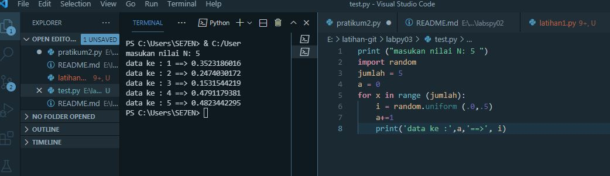
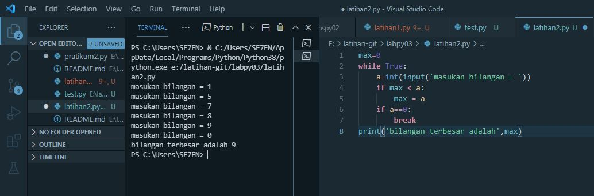
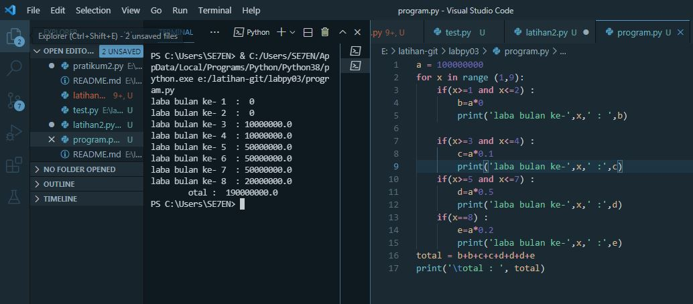

# labpy03
# latihan1
masukan nilai n : 5
lalu import random untuk menampilkan data
dengan = 5 
angka random 0.5 lalu print angka random 

# latihan2
 menampilkan nilai terbesar 
 max =0
 while untuk menampilkan perulangan tak terhitung masukan nilai
 maka nilai terbesar yang akan di tampilkan
 

 # program
 pertama gunakan for untuk perulangan 1-8
 lalu gunakan if pertama untuk menentukan laba ke 1 dan ke 2 masukan variabel dan kalikan 
 lalu gunakan if kedua untuk menentukan laba bulan ke 3 an ke 4 lalu kalikan
 lalu gunakan if ketiga untuk menentukan laba bulan ke 5 sampai ke 7 lalu kalikan
 dan gunakan if ke 4 untuk menentukan laba bulan ke 8 dan kalikan dengan data bulan ke 8
 dan total jumlah keseluruhan
 